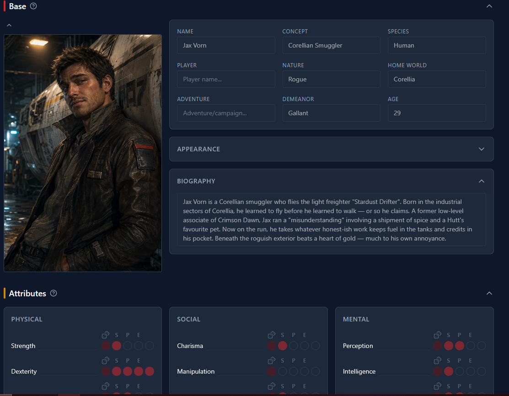
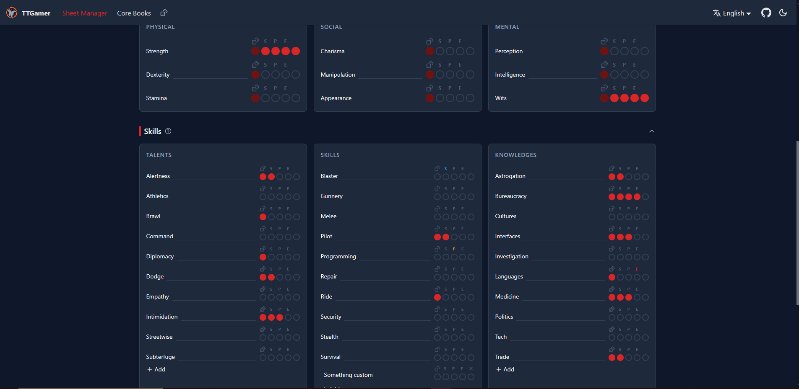
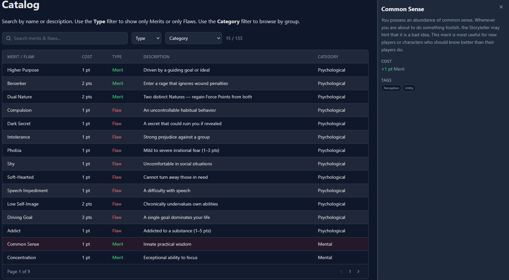
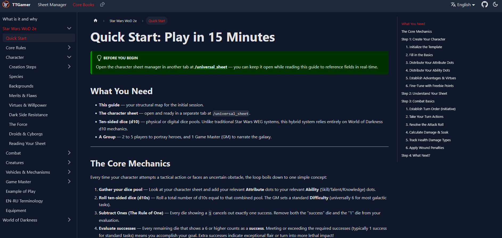

# TTGamer

A Docusaurus-based site hosting interactive documentation, a character sheet manager, and a 3D dice roller for a **Star Wars WEG/WoD hybrid TTRPG system**.

> **Live site:** [ttgamer.vercel.app](https://ttgamer.vercel.app)

---

## Features

### For Players

- **Character Sheet Manager** — Full-featured sheet with 9 attributes, 30 abilities (Talents/Skills/Knowledges), Force powers, Virtues/Willpower, backgrounds, merits/flaws, inventory, armor, weapons, dual health tracks (bashing/lethal), and auto-calculated derived stats. Supports **sentient**, **droid**, and **vehicle** characters.
- **3D Dice Roller** — Real-time 3D dice physics (WebGL + cannon-es), configurable surfaces (felt, wood, metal), sound effects, roll history, and full dice notation support. 2D SVG fallback included.
- **Inline Dice Rolls** — Clickable dice notation throughout the docs (e.g., `5d10>=6f=1`).
- **Data Catalogs** — Searchable, sortable, filterable interactive tables for species, Force powers, abilities, merits/flaws, backgrounds, equipment (ranged/melee/armor/consumables/tools), vehicles, creatures, and terminology.
- **Import/Export** — Share characters via JSON files.
- **Local-first Persistence** — Characters saved in IndexedDB via localForage — no account needed.
- **Interactive Documentation** — 29 complete MDX docs covering core rules, character creation (10-step guided process), combat, vehicles, GM tools, bestiary, and equipment.

### For GMs

- **Full GM Section** — Encounter balance, difficulty calibration (with interactive probability calculator), rewards & advancement, adventure design, and running-the-game principles.
- **Creature & NPC Tools** — Stat block templates, scale classification, special abilities.
- **Vehicle Mechanics** — Dogfighting, capital ship combat, damage/repair, modifications.

### For International Users

- **i18n** — English and Russian documentation fully translated (UI strings pending).

---

## Screenshots & Demos

<!-- TODO: Add screenshots/GIFs -->
<!--


-->

| Feature                 | Preview                                                           |
| ----------------------- | ----------------------------------------------------------------- |
| Character Sheet Manager |                        |
| 3D Dice Roller          |              |
| Data Catalogs           |  |
| Documentation           |                  |

---

## Documentation

The full system documentation lives under `/docs/star-wars-wod-2e/`:

| Section                 | Files                                                                                               | Status         |
| ----------------------- | --------------------------------------------------------------------------------------------------- | -------------- |
| Quick Start             | 1 file                                                                                              | ✅ Done        |
| Core Rules              | 2 files (dice pools, attributes/abilities)                                                          | ✅ Done        |
| Character Creation      | 10 files (step-by-step + species, backgrounds, merits/flaws, virtues, Force, droids, reading sheet) | ✅ Done        |
| Combat                  | 3 files (flow, health/damage, scales)                                                               | ✅ Done        |
| Equipment & Gear        | 1 file (weapons, armor, gear, price refs)                                                           | ✅ Done        |
| Creatures & Adversaries | 2 files (mechanics, bestiary)                                                                       | ✅ Done        |
| Vehicles                | 4 files (traits, damage, space combat, modifications)                                               | ✅ Done        |
| GM Section              | 5 files (encounters, difficulty, rewards, adventure design, running the game)                       | ✅ Done        |
| Polish                  | 3 files (example of play, en/ru glossary, index)                                                    | ✅ Done        |
| WoD (VtM 2e)            | Started — clans, disciplines, Blood Points, Humanity                                                | 🟡 In Progress |

---

## Prerequisites

- **Node.js** >= 20 (LTS recommended)
- **Yarn** 1.x (classic) — `npm install -g yarn`

## Quick Start

```bash
yarn install
yarn start
```

Opens the site at `http://localhost:3000`.

## Commands

| Command              | Description                         |
| -------------------- | ----------------------------------- |
| `yarn start`         | Start Docusaurus development server |
| `yarn build`         | Production build                    |
| `yarn serve`         | Preview production build            |
| `yarn typecheck`     | TypeScript type checking            |
| `yarn lint`          | ESLint + Prettier check             |
| `yarn lint:fix`      | ESLint + Prettier auto-fix          |
| `yarn format`        | Prettier format only                |
| `yarn format:check`  | Prettier check only                 |
| `yarn deploy`        | Deploy to GitHub Pages              |
| `yarn clear`         | Clear Docusaurus cache              |
| `yarn test`          | Run Vitest test suite               |
| `yarn test:watch`    | Vitest watch mode                   |
| `yarn test:coverage` | Vitest coverage report              |

---

## For Developers

### Project Structure

```
├── src/
│   ├── dice_roller/           # Dice roller module (logic, UI, 3D renderer)
│   │   ├── dice-logic/        #   Lexer, parser, evaluator, renderer engine
│   │   ├── components/        #   UI components (dice pool, roll history, 2D/3D dice)
│   │   └── store/             #   Zustand store for dice state
│   ├── sheet_manager/         # Character sheet manager module
│   │   ├── components/        #   UI components (modal, viewer, rows, dots, collapsible)
│   │   ├── features/sheet/    #   Sheet blocks (AttributeBlock, SkillBlock, HealthBlock, etc.)
│   │   ├── store/             #   Zustand store with IndexedDB persistence
│   │   ├── types/             #   Zod schemas + TypeScript types
│   │   ├── context/           #   CharacterContext for multi-character views
│   │   └── data/              #   Presets, defaults
│   ├── data/                  # Data layer for all catalogs (29 files)
│   │   ├── speciesData.ts     #   11 era-variant species
│   │   ├── forcePowersData.ts #   35 Force powers
│   │   ├── abilities.ts       #   30 abilities
│   │   ├── meritsFlawsData.ts #   Merits & flaws catalog
│   │   ├── backgroundsData.ts #   12 backgrounds
│   │   ├── vehicleData.ts     #   Vehicle stats
│   │   ├── creatureData.ts    #   Creature stat blocks
│   │   ├── rangedWeaponsData.ts, meleeWeaponsData.ts, armorData.ts, etc.
│   │   └── *Config.tsx        #   Column definitions + render functions
│   ├── shared/                # Shared utilities & components
│   │   ├── components/        #   DataCatalog, EntityCard, TWWrapper, BottomSheet, etc.
│   │   ├── hooks/             #   useLocalStorageState, useMediaQuery
│   │   └── utils/             #   diceNotation, logging, random, env
│   ├── pages/                 # Docusaurus pages
│   ├── theme/                 # Docusaurus theme swizzles (Root, NavbarItem)
│   └── css/                   # Global CSS + Tailwind setup
├── docs/                      # Documentation (MDX)
│   ├── star-wars-wod-2e/      # Main system docs (29 files, fully written)
│   └── wod/                   # World of Darkness (VtM 2e) docs (in progress)
├── i18n/                      # Translations (en, ru)
├── tests/                     # Test suite (Vitest)
│   └── dice_roller/           #   Evaluator, parser, utils, integration tests
├── static/                    # Static assets (images, sounds)
│   ├── sounds/dicehit/        #   40+ dice impact sounds (coin, metal, plastic, wood)
│   └── sounds/surfaces/       #   25+ surface impact sounds (felt, metal, wood)
├── docusaurus.config.ts
├── tailwind.config.cjs        # Must be CommonJS for webpack
├── postcss.config.js          # Must be CommonJS
├── tsconfig.json              # Solution → tsconfig.app.json + tsconfig.node.json
├── sidebars.ts
└── vitest.config.ts
```

### Architecture Highlights

- **Tailwind Isolation**: `@tailwind base` is NOT in `custom.css` to avoid resetting Infima/Docusaurus styles. Base resets are scoped to `.tailwind-root` via `tailwind-base-reset.scss`.
- **Module CSS**: Module pages import their own Tailwind stylesheet directly (e.g., `../../css/set_tailwind_styles.css`).
- **Module Separation**: `dice_roller/` and `sheet_manager/` are logically independent modules with their own `AGENTS.md`, `TODO.md`, and `TOFIX.md` files.
- **Dice Logic**: Custom lexer (`moo`), parser (`nearley`), and evaluator — 22 token types, 11 modifier evaluation steps. Separate Roll Engine (deterministic) and Render Engine (3D presentation).
- **State Management**: Zustand 5 with `persist` middleware, using `localForage` (IndexedDB) as the custom storage backend. Character mutations use shallow merge via `updateCharacter(id, partial)`.
- **Data Layer**: Type-safe data catalogs with `DataCatalog` component (TanStack Table) supporting search, sort, pagination, dual-filter (category + era), and detail popovers.
- **i18n**: Docusaurus-native i18n system. Docs are fully translated (en/ru). UI strings and data file labels pending.

### Key Design Decisions

| Decision                             | Rationale                                                      |
| ------------------------------------ | -------------------------------------------------------------- |
| Tailwind via `tailwind-root` scoping | Prevents conflict with Docusaurus/Infima styles                |
| `tailwind.config.cjs` as CommonJS    | Required by Docusaurus webpack config                          |
| `postcss.config.js` as CommonJS      | Root `package.json` has no `"type": "module"`                  |
| `clsx` for conditional classes       | Lighter than `classnames`, better DX                           |
| Zustand over Redux                   | Simpler API, built-in persist middleware                       |
| localForage over localStorage        | Async, IndexedDB under the hood (no 5MB limit)                 |
| Separate Roll vs Render engine       | Enables deterministic roll results + independent 3D/2D display |

### Testing

Tests use **Vitest** (migrated from Jest in v3.1.0):

```bash
yarn test                    # Run all tests
yarn test --watch            # Watch mode
yarn test --coverage         # Coverage report
```

Test files are in `tests/dice_roller/` covering:

- Evaluator: basic rolls, modifiers, explosion, reroll, combined expressions
- Parser: basic notation parsing
- Utils: constants, notation cleaning, SVG recoloring
- Integration: full pipeline (lex → parse → eval)

---

## Roadmap

### Done

- [x] Character sheet manager (sentient, droid)
- [x] 3D dice roller with physics, sound, and 2D fallback
- [x] Inline dice rolls in documentation
- [x] Full documentation (29 files across 10 sections)
- [x] Data catalogs (species, Force powers, abilities, merits/flaws, backgrounds, equipment, vehicles, creatures, terminology)
- [x] Character context & viewer mode (multiple characters, read-only view)
- [x] i18n docs translation (en/ru)

### In Progress

- [/] UI i18n translation (extract English strings into JSON files)
- [/] WoD/VtM 2e system documentation
- [/] Data file i18n (add `ru` fields to data entries)

### Planned

- [ ] Vehicle sheet
- [ ] Other systems sheets (D&D, Pathfinder)
- [ ] Database + authentication layer
- [ ] Lazy loading for 3D packages (three.js, cannon-es)
- [ ] Discord webhook integration (backend required)
- [ ] UI i18n for data files and UI strings
- [ ] Dice pool tabs for other systems (D&D, Pathfinder)

---

## Tech Stack

| Concern         | Technology                       |
| --------------- | -------------------------------- |
| Package Manager | yarn@1.22.22                     |
| Site Framework  | Docusaurus 3.10 (preset-classic) |
| Frontend        | React 19 + TypeScript 6 (strict) |
| State           | Zustand 5 (persist middleware)   |
| Styling         | Tailwind CSS 3 + clsx            |
| Forms           | React Hook Form + Zod            |
| Persistence     | localForage (IndexedDB)          |
| Icons           | Lucide-react                     |
| Components      | Radix UI primitives              |
| Testing         | Vitest                           |
| i18n            | Docusaurus i18n (en, ru)         |
| 3D Rendering    | Three.js + cannon-es             |
| Dice Logic      | moo (lexer), nearley (parser)    |

---

## License

See [LICENSE](./LICENSE) for details.
